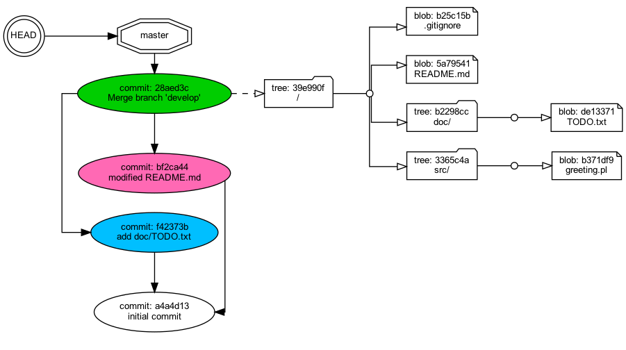

# Gitの内部データ構造をGraphvizで描画してみた 第2回 ブランチとマージ

## 解決すべき問題

一年前のこと、Subversionを長く使ってきた開発チームにGitを教えようとした。わたしはGitの*ブランチ*をちゃんと説明したかった。というのもSubversionにもブランチという用語があるが、GitのブランチはSubversionとは似て非なるものだからだ。"Git"と"Subversion"と"ブランチ"をキーにネットを検索すると解説記事がたくさんみつかった。だがわたしが同僚諸君に説明するのに使えるようなひと目で理解できる記事が見当たらなかった。

いま自分の手元にあるプロジェクトの`.git`ディレクトリのなかにあるGitレポジトリの実物を読み出して図にしてくれる、そういうツールがほしい。

## 解決方法

Pythonでツール [`kazurayam/visualize_git_repository.py`](https://github.com/kazurayam/visualizing-git-repository) を開発した。これを使えばいま自分の手元にあるプロジェクトの .git ディレクトリのなかにあるオブジェクト群の実物を読み出し、Graphvizでグラフを生成してPNG画像ファイルを出力することができる。

## 説明

デモ用にディレクトリを作りGitレポジトリを作ろう。masterブランチとdevelopブランチでファイルを追加・変更などして、developをmasterにマージしよう。Gitレポジトリのなかがどんなふうに形を変化させていくか、図を示しつつ、説明しよう。

### ステップ1 最初のコミット

新しいGitレポジトリを作ろう。いくつかファイルを作ってコミットしよう。

- 作業用ディレクトリを作った

- `git init`した

- ファイルを３つ作った。`README.md`、`.gitignore`、`src/greeting.pl`を。

- `git add .`した

- `git commit -m "initial commit'`した

この時点で`visualize_git_repository`ツールを実行したら次のグラフが生成された。

| master | develop |
| :----------: | :-----------: |
|  | まだ無い |

このグラフから次のことが読みとれる。

1. `git init`すると`master`という参照名が自動的に作られる。
   
2. Gitにおいて**ブランチ**とはひとつのcommitオブジェクトを指す別名にすぎない。上記の図で参照名 `master` は `initial commit` というコメントを含むひとつのcommitオブジェクトを指す別名にすぎない。

3. Gitには **`HEAD`** という名前の参照名が組み込みで定義されている。`HEAD`もやはりひとつのcommitオブジェクトを指す。上記の図で`HEAD`は参照名`master`を指しているが、`master`がcommitオブジェクトを指すので、けっきょく`HEAD`も`master`を介して間接的にひとつのcommitオブジェクトを指すと解釈することができる。

5. `HEAD`は特殊な参照名だ。さまざまの`git xxx`コマンドを実行した副作用として`HEAD`が指すモノが切り替わる。

6. 参照名`HEAD`が参照名`master`を指しているという状態を「*カレント・ブランチがmasterである*」と表現することもある。この言い方のほうが日本語としてすなおなので多用するだろう。以下で「カレント・ブランチが...」という文がでてきたら、参照名`HEAD`から伸びた矢印 → が何を指しているかを思い浮かべてほしい。

### ステップ2 developブランチを作る

新しいブランチ `develop` を追加しよう。

- カレント・ブランチがmasterである状態で `git branch develop`コマンドを実行した

この時点で`visualize_git_repository`ツールを実行したら次のグラフが生成された。

| master | develop |
| :----------: | :-----------: |
| 前と同じ |  |

このグラフから次のことが読みとれる。

1. 新しい参照名 `develop` が作られた。

2. 参照名 `develop` は`initial commit`というコメントを含む
commitオブジェクト すなわち `master` が指していたのと同じcommitオブジェクトを指している。
   
3. 参照名`HEAD`が参照名`develop`を指すかたちに変更された。別の言い方をすると カレント・ブランチが`master`から`develop`に切り替えられた。

4. カレント・ブランチが`develop`に切り替えられた後でも参照名`master`はGitレポジトリのなかに存続している。上の図ではmasterの図を省略したがそれは図をシンプルにして見やすくするためであって、消えてなくなったわけではない。

### ステップ3 developでコミットする

`develop`ブランチで新しいファイルを追加してコミットしよう。

- ワーキングツリーで新しいファイル `doc/TODO.txt` を追加した

- カレント・ブランチが`develop`であることをたしかめて
  
- `git add .`を実行した

- `git commit -m "add doc/TXT.txt"`を実行した

この時点で`visualize_git_repository`ツールを実行したら次のグラフが生成された。

| master | develop |
| :----------: | :-----------: |
| 前と同じ |  |

このグラフから次のことが読みとれる。

1. 新しいcommitオブジェクトができた。新しいcommitオブジェクトが親commitにリンクする形になり、commitオブジェクトの鎖がひとつ伸びた。新しいcommitオブジェクトはルートディレクトリ `/` を指すtreeオブジェクトにリンクしている。treeのなかには `doc/TODO.txt` ファイルのblobオブジェクトがある。つまり追加したファイルがちゃんと認識されている。

2. 参照名`develop`すなわちdevelopブランチがどのcommitオブジェクトを指しているか？を見ると自動的に更新されたのがわかる。ブランチ名はcommitオブジェクトの鎖の端っこ(ゴーヤの蔓の成長点のようなところ)を指すようにgitによって自動的に更新されるのだ。

### ステップ4 masterブランチに戻る

ファイル `README.md` を修正してコミットする前に、`master`ブランチに戻ろう。

- `git checkout master` を実行した

この時点で`visualize_git_repository`ツールを実行したら次のグラフが生成された。

| master | develop |
| :----------: | :-----------: |
|  | 前と同じ |

このグラフから次のことが読みとれる。

1. 参照名 `HEAD` が参照名 `master` を指すように更新された。すなわちカレント・ブランチが`master`に切り替わった。

2. masterブランチの中身は1回目のcommitをした時のままで変わっていない。

3. カレント・ブランチが`master`に切り替えられた後でも参照名`develop`はGitレポジトリのなかに存続している。上の図ではdevelopの図を省略したがそれは図をシンプルにして見やすくするためであって、消えてなくなったわけではない。

### ステップ5 masterでコミットする

masterブランチで既存の`README.md`ファイルを変更してコミットしよう。

- `git branch --show-current`とやってカレント・ブランチがmasterであることを確かめた
  
- `echo "#Read me carefully" > README.md`とやってファイルを更新した

- `git add .`した

- `git commit -m "modified README.md"`とやった

この時点で`visualize_git_repository`ツールを実行したら次のグラフが生成された。

| master | develop |
| :----------: | :-----------: |
|  | 前と同じ |

このグラフから次のことが読みとれる。

- 新しいcommitオブジェクトができた。新しいcommitオブジェクトが指すtreeのなかにある`README.md`ファイルのblobをみるとhash値が変わっている。つまり変更された`README.md`ファイルのために新しいblobオブジェクトがひとつ生成されて、そのhash値をcommitが参照している。これこそが「*変更後のREADME.mdファイルがレポジトリにコミットされた*」という表現の意味するところだ。
- 参照名 `master` が新しいcommitオブジェクトを指すように更新された。


### ステップ6 developをmasterにマージする

`develop`ブランチを`master`ブランチにマージしよう。すなわち`develop`ブランチで行ったファイルの追加・変更・削除を`master`ブランチにとり込もう。

- `git branch --show-current`とやってカレント・ブランチがmasterであることを確かめた

- `git merge develop`とやった

この時点で`visualize_git_repository`ツールを実行したら次のグラフが生成された。

| master | develop |
| :----------: | :-----------: |
|  | 前と同じ |

このグラフから次のことが読みとれる。

1. マージする前にmasterブランチにはcommitオブジェクトが2個あった。マージした後にmasterブランチにcommitオブジェクトが4個ある。2個増えた。

1. 増えた2個のcommitオブジェクトのうちひとつはもともと`develop`ブランチで作られたものだ。`add doc/TODO.txt`というコミットメッセージをもっている。`develop`ブランチだけで見えていたcommitオブジェクトが`git merge develop`コマンドによって`master`ブランチでも見えるようになった。

1. 増えた2個のcommitオブジェクトのうち残るひとつは新しく`master`ブランチに追加されたものだ。このcommitオブジェクトは親(parent)コミットを2つ持っている点が特徴的だ。これをマージコミットともいう。
   
1. マージコミットの親コミット2つとはカレント・ブランチの先端にあったcommitオブジェクトと、マージされたブランチの先端にあったcommitオブジェクトである。マージコミットによってコミットの履歴2本が合流する。マージコミットより古い履歴は2本のまま残されて、マージコミットからあとは1本の履歴が始まる。

1. 参照名 `master` はマージコミットを指すように自動的に更新された。

1. マージコミットは普通のcommitオブジェクトと同様にルートディレクトリ `/` に対応するtreeオブジェクトへの参照をもっている。そのtreeオブジェクトを起点としてすべてのファイルのblobオブジェクトを参照することができる。それらblobはmasterブランチとdevelopブランチにおいてこれまでに追加・変更・削除されたファイルの最新状態が反映されている。

1. 上の図ではマージコミットが指しているtreeオブジェクトだけを描き、時系列的に古いcommitオブジェクトが指しているtreeオブジェクトを省略した。これは図を簡素化するためだ。treeオブジェクトがGitレポジトリから消えて無くなったわけではない。


### ツールについて

本稿で示したPNG画像は自作のツール `visualize_git_repository` で描画した。このツールはPython言語で開発した。ソースコードは下記のGitHubレポジトリにある。

- https://github.com/kazurayam/visualizing-git-repository

このツールは下記2つのライブラリを利用している。

- [pytest](https://pypi.org/project/pytest/)
- [python graphviz](https://pypi.org/project/graphviz/)

PNG画像を生成するにはコマンドラインで下記の操作をする。

```
$ cd $visualize_git_repository
$ pytest -s kazurayam/visualize_git_repository.py::test_2_branch_and_merge
```

上記の例を作るのにどういうgitコマンドを実行したのかを知りたいならプログラムのソースコードを読み解いてください。下記を入り口として解読してください。

- [kazurayam/visualize_git_repository.py](kazurayam/visualize_git_repository_test.py)

## まとめ

一年前の同僚諸君に本稿を読んでもらいたいなあ。これならGitの*ブランチ*と*マージ*が理解できるだろうと思うのだが、どうだろうか？

- author: kazurayam
- date: June, 2021


# 連作の目次

- [第1回 commitとtreeとblob](https://qiita.com/kazurayam/items/deea847acaa043a52e36)
- [第2回 ブランチとマージ](https://qiita.com/kazurayam/items/18419085764ff1d81406)
- [第3回 タグ](https://qiita.com/kazurayam/items/4ed4c69078c86c2f1a8c)