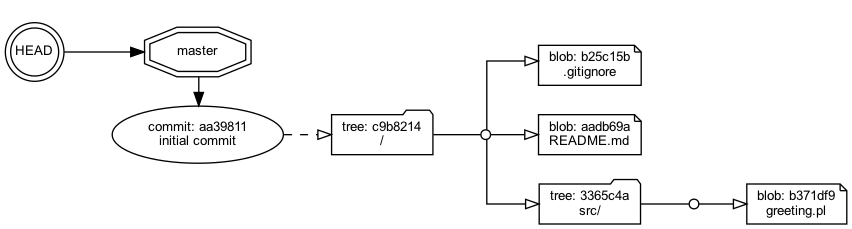
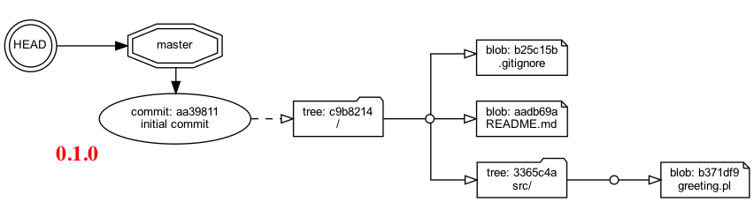
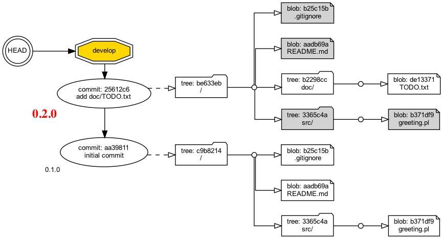
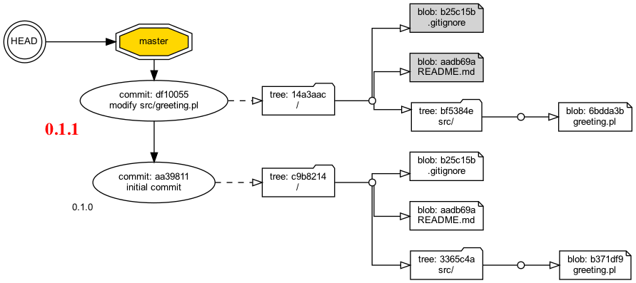
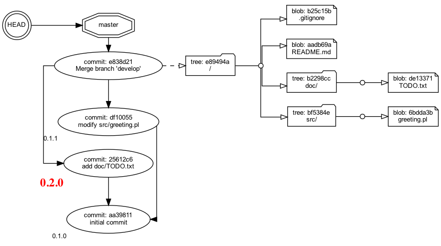
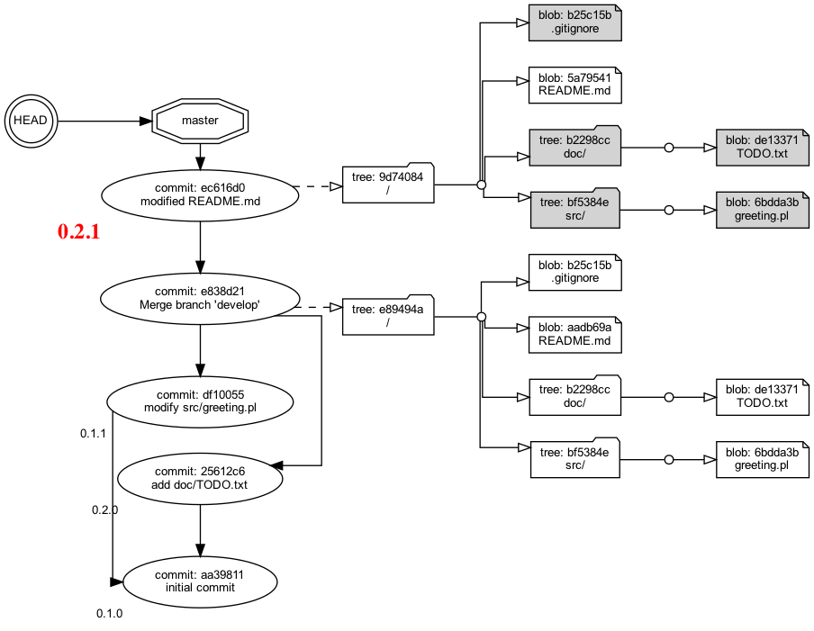

# Gitレポジトリの内部のデータ構造をGraphvizで描画してみた 第3回 タグ

## 解決すべき問題

```
$ git tag 0.1.0
```
こういうコマンドを実行すればGitレポジトリのなかでタグが作られる。Gitのタグとは何か？「[サル先生のGit入門 タグ](https://backlog.com/ja/git-tutorial/stepup/17/) 」によればこうだ。

>タグとは、コミットを参照しやすくするために、わかりやすい名前を付けるものです。

説明はこれで尽きる。でもタグを図に描いたらどうなるんだろう。複数のブランチを作ってそれぞれにたくさんタグを打ったら全体としてどう見えるだろう。

## 解決方法

Pythonでツール [`kazurayam/visualize_git_repository.py`](https://github.com/kazurayam/visualizing-git-repository) を開発した。これを使えばいま自分の手元にあるプロジェクトの .git ディレクトリのなかにあるオブジェクト群の実物を読み出し、Graphvizでグラフを生成してPNG画像ファイルを出力することができる。


## 説明

デモ用にディレクトリを作りGitレポジトリを作ろう。masterブランチとdevelopブランチでファイルを追加・変更などして、developをmasterにマージしよう。途中適宜にタグをつけていこう。Gitレポジトリの中がどのように形を変化させていくか、とくにタグがどんなふうに見えるか、図を示しつつ説明しよう。

### ステップ1 最初のコミットをする

新しいGitレポジトリを作ろう。いくつかファイルを作ってコミットしよう。

- 作業用ディレクトリを作った

- `git init`した

- ファイルを３つ(`README.md`、`.gitignore`、`src/greeting.pl`)作った。

- `git add .`した

- `git commit -m "initial commit'`した

この時点ではまだタグがありません。この時点で`visualize_git_repository`ツールを実行したら次のグラフが生成された。

| master | develop |
| :----------: | :-----------: |
|  | まだ無い |


### ステップ2 最初のコミットにタグ 0.1.0 を打つ

タグ `0.1.0` を打ちましょう。

- `% git tag 0.1.0` コマンドを実行した。

この時点で`visualize_git_repository`ツールを実行したら次のグラフが生成された。

| master | develop |
| :----------: | :-----------: |
|  | まだ無い |

このグラフから次のことが読みとれる。

1. `git tag XXXX`コマンドは`git tag XXXX HEAD`と同じ意味だ。つまり特殊な参照名 HEAD が指すところのcommitオブジェクトにたいして`XXXX`というタグを付ける。HEADが指すcommitオブジェクトとはつまり最後に実行した`git commit -m "....."`コマンドによって作られた最新のcommitオブジェクトだ。

### ステップ3 `develop`ブランチでタグ 0.2.0 を打つ

新しく`develop`ブランチを作ろう。developブランチでファイル`doc/TODO.txt`を追加してコミットしよう。そしてタグ `0.2.0` を打とう。

- `git branch --show-current`コマンドでいまカレントブランチがmasterであることを確認してから

- `git branch develop` を実行した

- ファイル `doc/TODO.txt` を追加した
  
- `git add .` を実行した

- `git commit -m "add doc"` を実行した

- `git tag 0.2.0` を実行した

この時点で`visualize_git_repository`ツールを実行したら次のグラフが生成された。

| master | develop |
| :----------: | :-----------: |
| 前と同じ |  |

このグラフから次のことが読みとれる。

1. いまカレント・ブランチがdevelopなのだが、masterブランチにおいて打ったタグ `0.1.0` が見えている。えっ！そうなんですか？「タグ `0.1.0` はmasterブランチで打ったタグなのだから、developブランチではタグ `0.1.0` が見えなくなるだろう」とわたしは思っていたが、そうじゃないんだ。

タグが個々のcommitオブジェクトに付けられた名札のようなものという基本に戻ろう。**タグを作る時にカレント・ブランチが何だったかはタグの性質に影響しない**。この絵をみてわたしははじめて納得しました。

### ステップ4 masterブランチでタグ 0.1.1 を打つ

masterブランチに戻って、masterブランチでもタグをひとつ打ってみよう。どう
見えるか？

- `git checkout master` を実行した
  
- ファイル `src/greeting.pl` を修正した
  
- `git add .` を実行した

- `git commit -m "modify src/greeting.pl"` を実行した

- `git tag 0.1.1` を実行した

この時点で`visualize_git_repository`ツールを実行したら次のグラフが生成された。

| master | develop |
| :----------: | :-----------: |
|  | 前と同じ |

このグラフから次のことが読みとれる。

1. さきほどdevelopブランチでタグ `0.2.0` を打ったが、masterブランチではそれが見えない。

developブランチをまだmasterにマージしていないのだから、masterからdevelopの変更点が見えないのは当然だ。

### ステップ5 developブランチをmasterにマージする

developブランチをmasterにマージしよう。

- `git merge develop` を実行した

この時点で`visualize_git_repository`ツールを実行したら次のグラフが生成された。

| master | develop |
| :----------: | :-----------: |
|  | 前と同じ |

このグラフから次のことが読みとれる。

1. タグ `0.2.0` が付いたcommitオブジェクトがマージされて、masterブランチにおいて見えるようになった。

2. タグ `0.2.0` が付いたコミットとタグ `0.1.1` が付いたコミットがグラフのなかで上下逆順に並んでいるのを見ておや？と迷うかもしれない。気にしないでほしい。タグの文字つまり`0.2.0`と`0.1.1`を数として読んだときにわれわれが感じる意味的順序どおりにcommitノードをGraphvizが配置するようにツールを作ってはいない。必要なことではないと思うから。


### ステップ6 masterブランチでタグ 0.2.1 を打つ

さいごに、masterブランチで`README.md`ファイルを修正してコミットし、タグ `0.2.1` を打とう。

- ファイル `README.md` を修正した

- `git add .` を実行した

- `git commit -m "modified README.md"` を実行した

- `git tag 0.2.1` を実行した

この時点で`visualize_git_repository`ツールを実行したら次のグラフが生成された。

| master | develop |
| :----------: | :-----------: |
| 前と同じ |  |

はい。もう付け足すことはありません。

### ツールについて

本稿で示したPNG画像は自作のツール `visualize_git_repository` で描画した。このツールはPython言語で開発した。ソースコードは下記のGitHubレポジトリにある。

- https://github.com/kazurayam/visualizing-git-repository

このツールは下記2つのライブラリを利用している。

- [pytest](https://pypi.org/project/pytest/)
- [python graphviz](https://pypi.org/project/graphviz/)

PNG画像を生成するにはコマンドラインで下記の操作をする。

```
$ cd $visualize_git_repository
$ pytest -s kazurayam/visualize_git_repository.py::test_3_tags
```

上記の例を作るのにどういうgitコマンドを実行したのかを知りたいならプログラムのソースコードを読み解いてください。下記を入り口として解読してください。

- [kazurayam/visualize_git_repository.py](kazurayam/visualize_git_repository_test.py)

## まとめ

「タグとは、コミットを参照しやすくするために、わかりやすい名前を付けるものです」という説明をクリアに図示することができたとおもいます。

- author: kazurayam
- date: June, 2021

# 連作の目次

- [第1回 commitとtreeとblob](https://qiita.com/kazurayam/items/deea847acaa043a52e36)
- [第2回 ブランチとマージ](https://qiita.com/kazurayam/items/18419085764ff1d81406)
- [第3回 タグ](https://qiita.com/kazurayam/items/4ed4c69078c86c2f1a8c)