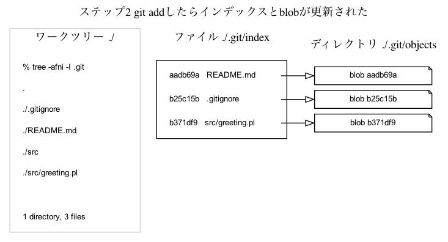
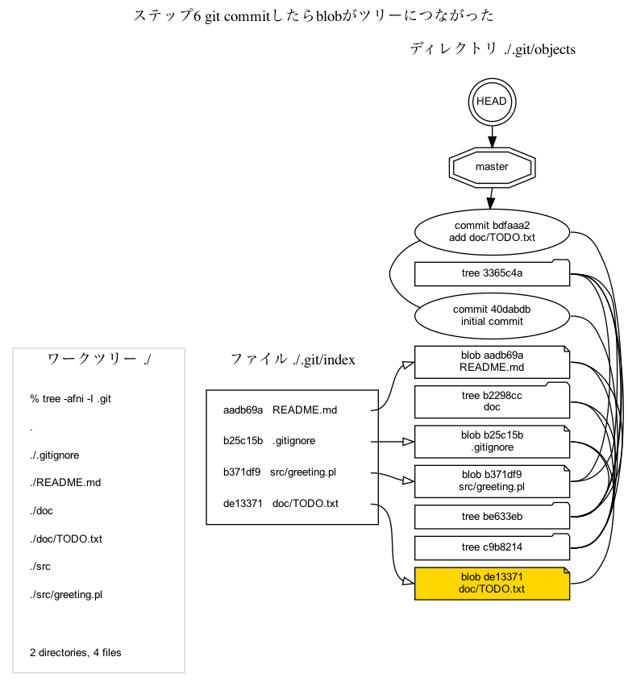
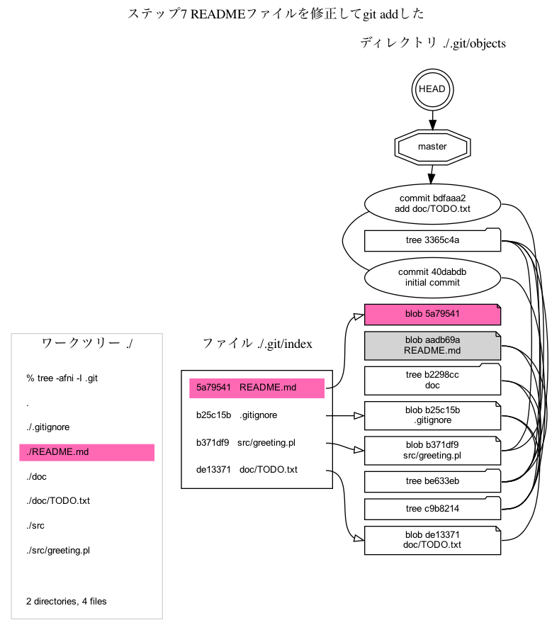
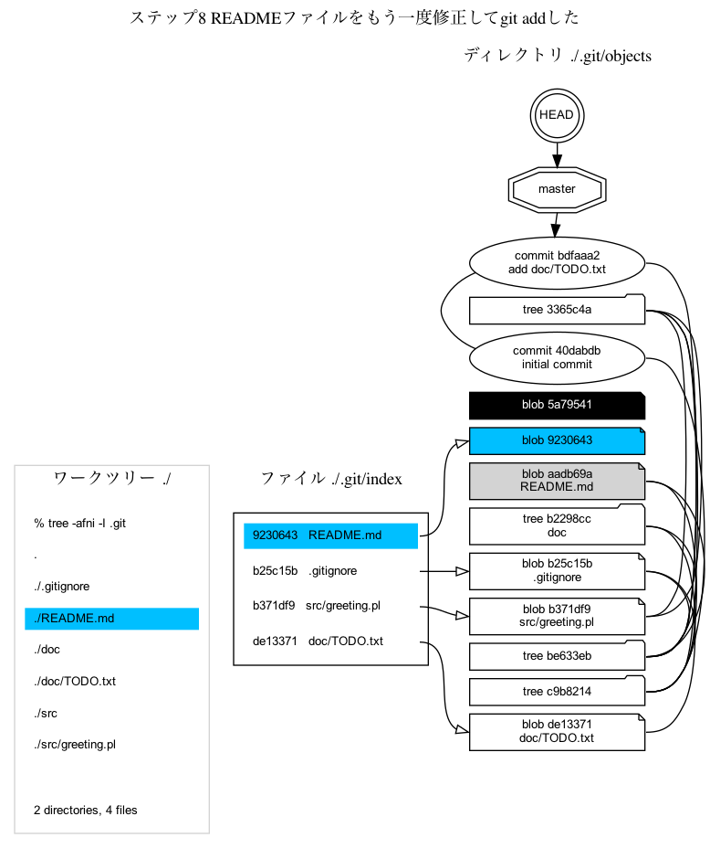
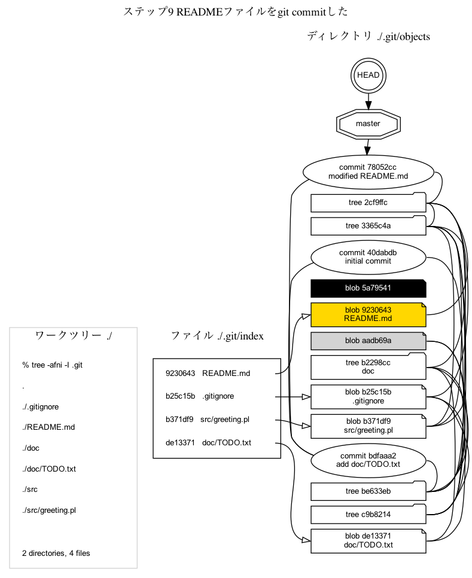

# Gitの内部データ構造をGraphvizで描画してみた 第4回 ワークツリーとインデックスとblob

## 解決すべき問題

...

## 解決方法

## 説明

### ステップ1 `git init`した後で`git add`する前

### ステップ2 `git add`したらインデックスとblobが更新された

### ステップ3 `git commit`したらblobがツリーにつながった

### ステップ4 TODO.txtファイルを追加して`git add`する前

### ステップ5 `git add`したらインデックスとblobが更新された

### ステップ6 `git commit`したらblobがツリーにつながった

### ステップ7 READMEファイルを修正して`git add`した

### ステップ8 READMEファイルをもう一度修正して`git add`した

### ステップ9 READMEファイルを`git commit`した

[git gc](https://git-scm.com/docs/git-gc)

## まとめ

