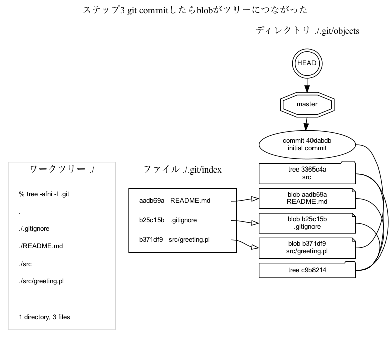
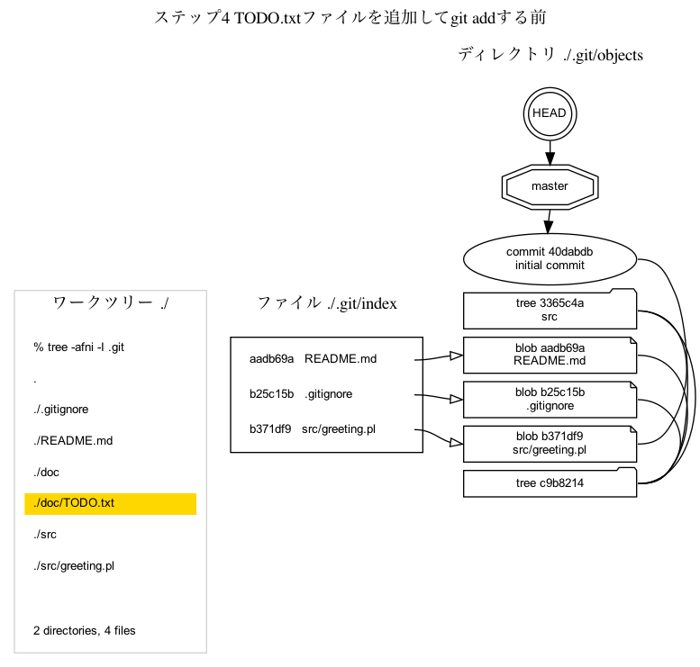

# Gitの内部データ構造をGraphvizで描画してみた 第4回 ワークツリーとインデックスとblob

## 解決すべき問題

`git add`コマンドや`git commit`コマンドを実行したときGitレポジトリのなかで何がおきているのだろう？図で説明してほしい。

## 解決方法

Pythonでツール [`kazurayam/visualize_git_repository.py`](https://github.com/kazurayam/visualizing-git-repository) を開発した。これを使えばいま自分の手元にあるプロジェクトの .git ディレクトリのなかにあるオブジェクト群の実物を読み出し、Graphvizでグラフを生成してPNG画像ファイルを出力することができる。

## 説明

デモ用にディレクトリを作りファイルを３つ作ろう。`git init`コマンドでGitレポジトリを作ろう。`git add`したらインデクスが更新されblobオブジェクトが作られる。そして`git commit`したらblobがレポジトリに登録される。このときGitレポジトリの中で何が起きているのだろうか？Graphvizで図示してみよう。

おまけに応用問題をひとつ。ファイルを修正して`git add`したあと、`git commit`せずに続けてもう一度ファイルを修正して`git add`したとしよう。Gitレポジトリの中で何が起きるのだろうか？ Graphvizで図示してみよう。

### ステップ1 `git init`した後で`git add`する前

デモ用のディレクトリを作ろう。このディレクトリのことを以下で `$project` という記号で表すことにします。

```
% mkdir $project
% cd $project
```

このディレクトリのなかにファイルを3つ作ろう。

```
% echo '*~' > .gitignore
% echo '#Read me plase' > README.md
% mkdir src
% echo 'print("How do you do?");' > src/greeting.pl
```

このディレクトリにGitレポジトリを作ろう。

```
% git init
```

シェルコマンド `ls` で `$project`ディレクトリの内容を確認しよう。

```
% ls -la .
total 16
drwxr-xr-x  6 kazuakiurayama  staff  192  6 12 12:58 .
drwxr-xr-x  4 kazuakiurayama  staff  128  6 12 12:58 ..
drwxr-xr-x  7 kazuakiurayama  staff  224  6 12 12:58 .git
-rw-r--r--  1 kazuakiurayama  staff    3  6 12 12:58 .gitignore
-rw-r--r--  1 kazuakiurayama  staff   17  6 12 12:58 README.md
drwxr-xr-x  3 kazuakiurayama  staff   96  6 12 12:58 src
```

`$project/.git`というディレクトリができている。`.git`ディレクトリがいわゆる「Gitレポジトリ」の実体だ。

`.git`ディレクトリの中に何があるのだろうか？lsコマンドでみてみよう。

```
% ls -la ./.git
total 16
drwxr-xr-x  7 kazuakiurayama  staff  224  6 12 12:58 .
drwxr-xr-x  6 kazuakiurayama  staff  192  6 12 12:58 ..
-rw-r--r--  1 kazuakiurayama  staff   23  6 12 12:58 HEAD
-rw-r--r--  1 kazuakiurayama  staff  137  6 12 12:58 config
drwxr-xr-x  5 kazuakiurayama  staff  160  6 12 12:58 hooks
drwxr-xr-x  4 kazuakiurayama  staff  128  6 12 12:58 objects
drwxr-xr-x  4 kazuakiurayama  staff  128  6 12 12:58 refs
```

`$project/.git/objects`というディレクトリができている。このなかにcommitオブジェクト、treeオブジェクト、blobオブジェクトのファイルが作られて保存される。

この時点で`visualize_git_repository`ツールを実行したら次のグラフが生成された。


このグラフから次のことが読みとれる。

1. Git用語「インデックス」とは具体的には `$project/.git/index` という名前のバイナリファイル1個である。ところがこの段階では`git init`した直後なので`index`ファイルはできていない。`index`ファイルは`git add`コマンドで作られるのだ。

1. `$project/.git/objects`ディレクトリはできているがまだ中身が空っぽだ。`git init`した直後なので無理もない。

### ステップ2 `git add`したらインデックスとblobが更新された

git addコマンドを実行しよう。何が起こるだろうか？

```
% git add
```

この時点で`visualize_git_repository`ツールを実行したら次のグラフが生成された。


このグラフから次のことが読みとれる。

1. 3つのファイルに対応するblobオブジェクトが`.git/objects`ディレクトリの中にひとつづつ計3個できた。

1. インデックスが作られた。インデックスの中には3行あって、ファイルのパスとそれに対応するblobオブジェクトのhash値が記録されている。

1. ワークツリーのなかに`src`というディレクトリがある。ところがインデックスのなかにはディレクトリに対応する行が無い。ワークツリーのなかのファイルに相当する行だけがインデックスのなかにある。サブディレクトリの下にあるファイルのパス文字列としてサブディレクトリがあることが示唆されている。たとえば`src/greeting.pl`のように。

1. ワークツリーのなかに`src`というディレクトリがある。ところが`.git/objects`のなかにはそれに対応するモノがない。

`git add`コマンドは2つの仕事をするのだ。第一にワークツリーにあるファイルを変換してblobオブジェクトを作りだすこと。第二にインデックスを更新すること。

`git add`コマンドはtreeオブジェクトを作らない。treeオブジェクトを作りだすのは`git commit`コマンドの役割なのだ。

### ステップ3 `git commit`したらblobがツリーにつながった

さあ、コミットしよう。

```
% git commit -m "initial commit"
```

この時点で`visualize_git_repository`ツールを実行したら次のグラフが生成された。



このグラフから次のことが読みとれる。

1. `.git/objects`ディレクトリのなかにcommitオブジェクトとtreeオブジェクトができた。commitからtreeへ線がつながり、treeからblobへ線がつながった。追加した3つのファイルのblobオブジェクトはひとつ残らずcommitから参照可能な形になった。

1. ワークツリーの`src` ディレクトリに相当する行がインデックスのなかには無かった。ところが`.git/objects`ディレクトリのなかには`src`に相当するtreeオブジェクトができている。`git commit`コマンドが実行されたとき、インデックスに記録されていた`src/greeting.pl`というファイルパス文字列に基づいてtreeオブジェクトが生成されたのだ。

1. インデックスの内容に変化は無い。`git commit`コマンドがインデックスを変更しないことがわかる

### ステップ4 TODO.txtファイルを追加して`git add`する前

ワークツリーに`src/TODO.txt`ファイルを追加しよう。

```
% mkdir doc
% echo 'Sleep well tonight.' > doc/TODO.txt
```

まだ `git add` しない。この時点で`visualize_git_repository`ツールを実行したら次のグラフが生成された。



このグラフから次のことが読みとれる。

1. ワークツリーでファイルをどんなにいじっても`git add`しないうちはGitレポジトリになんら影響を及ぼさない。


### ステップ5 `git add`したらインデックスとblobが更新された

では`git add`しよう。

```
% git add .
```

この時点で`visualize_git_repository`ツールを実行したら次のグラフが生成された。


このグラフから次のことが読みとれる。

1. ワークツリーに追加された`src/TODO.txt`ファイルに対応するblobオブジェクトが作られた。

1. そのblobがインデックスに含まれるようになった。

1. addされたblobオブジェクトはtreeオブジェクトと線でつながっていない。孤立している。

### ステップ6 `git commit`したらblobがツリーにつながった

では`git commit`しよう。

```
% git commit -m "add src/TODO.txt"
```

この時点で`visualize_git_repository`ツールを実行したら次のグラフが生成された。


このグラフから次のことが読みとれる。

1. `doc/TODO.txt`ファイルに対応するblobオブジェクトがほかのtreeオブジェクトと線でつながった。つまり`doc/TODO.txt`ファイルがコミットされた。

これでひと仕事済んだ。

### ステップ7 READMEファイルを修正して`git add`した

応用問題をやろう。すなわちワークツリーにすでにある`README.md`ファイルを修正し、`git add`しよう。Gitレポジトリのなかで何が変化するだろうか？

まず`REDME.md`ファイルを修正しよう。

```
% echo 'Read me more carefully' > README.md
```

`git add`しよう。

```
% git add .
```

この時点で`visualize_git_repository`ツールを実行したら次のグラフが生成された。


このグラフから次のことが読みとれる。

1. 修正した後の`README.md`ファイルに対応するblobオブジェクト(hash=`5a79541`)が追加された。
   
1. インデックスをみると`README.md`ファイルのhashは新しいblobオブジェクトのhashに交換されている。

1. 修正される前の`README.md`ファイルに対応するblobオブジェクト(hash=`aadb69a`)は`.git/objects`ディレクトリの中に残っている。いったんcommitされたblobは原則的に削除されないのだ。このblobは過去のcommitオブジェクトからリンクされていて履歴として参照可能だ。


### ステップ8 READMEファイルをもう一度修正して`git add`した

`README`ファイルを修正して`git add`したあとふつうなら`git commit`するところだがここでひとつ実験しよう。もう一度`README`ファイルを修正して`git add`したら、インデックスやblobオブジェクトはどういう状態になるのだろうか？

READMEファイルを修正しよう。

```
% echo 'I know you didnt read me.' > README.md
```

addしよう。

```
% git add .
```

この時点で`visualize_git_repository`ツールを実行したら次のグラフが生成された。


このグラフから次のことが読みとれる。

1. 修正された`README.md`ファイルに対応する新しいblobオブジェクト(hash=`9230643`)ができた。インデックスが新しいblobを参照するように更新された。
1. 前回`git add`したとき作られたblobオブジェクト(hash=5a79541)は`.git/objects`ディレクトリに残っている。ただしこのblobは完全に孤立している。すなわちtreeオブジェクトと線でつながっていないし、インデックスともつながっていない。

### ステップ9 READMEファイルを`git commit`した

コミットして締めくくろう。

```
% git commit -m "modified README.md"`
```

この時点で`visualize_git_repository`ツールを実行したら次のグラフが生成された。


このグラフから次のことが読みとれる。

1. commitオブジェクトがひとつ増えた。最新のcommitオブジェクトから線が伸びて最新状態のREADME.mdファイルのblobが参照される形になった。

1. addされたがcommitされなかったblobオブジェクト(hash=`5a79541`)は放置されている。

三度目のコミットが完了した。めでたしめでたし。

### ゴミ掃除

孤立したblobオブジェクトはこの先どうなる運命なのでしょうか？ じつはGitはゴミ掃除をする機能を備えていて、適切なタイミングで自動的にゴミ掃除を済ませてくれる。

- [git gc](https://git-scm.com/docs/git-gc)

ここでは深堀りしません。

### ツールについて

本稿で示したPNG画像は自作のツール `visualize_git_repository` で描画した。このツールはPython言語で開発した。ソースコードは下記のGitHubレポジトリにある。

- https://github.com/kazurayam/visualizing-git-repository

このツールは下記2つのライブラリを利用している。

- [pytest](https://pypi.org/project/pytest/)
- [python graphviz](https://pypi.org/project/graphviz/)

PNG画像を生成するにはコマンドラインで下記の操作をする。

```
$ cd $visualize_git_repository
$ pytest -s kazurayam/visualize_git_repository.py::test_4_index
```

上記の例を作るのにどういうgitコマンドを実行したのかを知りたいならプログラムのソースコードを読み解いてください。下記を入り口として解読してください。

- [kazurayam/visualize_git_repository.py](kazurayam/visualize_git_repository_test.py)

## まとめ

`git add`とやったとき、`git commit`とやったときGitレポジトリの中でデータがどのように変化していくのかをクリアに図示することができたとおもいます。

具体的で細かい情報満載のグラフを9個作った。作画ツールでグラフを手書きするやりかたでは9個も作れなかっただろう。gitコマンドでGitレポジトリの状態を読み出してDOT言語に変換しGraphvizで図を描くというやり方だからできた。


- author: kazurayam
- date: June, 2021


