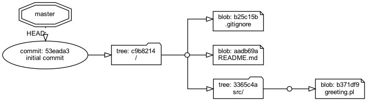
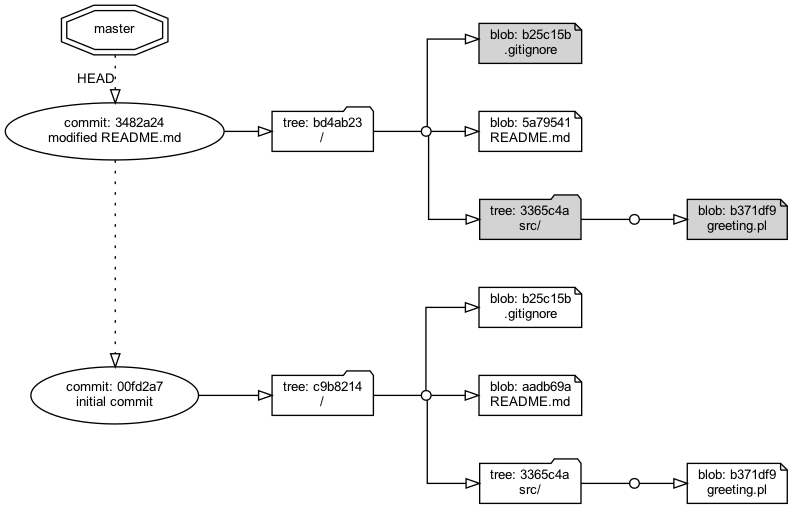
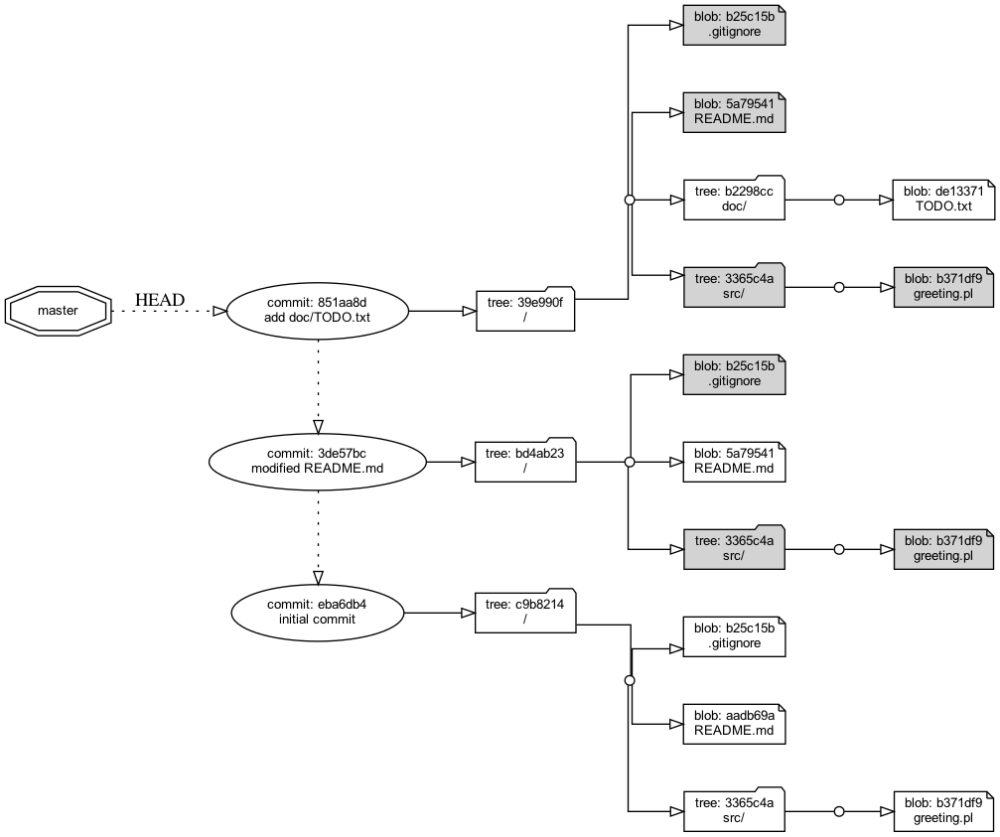

# Gitレポジトリの内部構造をGraphvizでグラフ化してみた

## 解決すべき問題

わたしは毎日Gitを使います。まず`git init`する。そのあと`git add xxx`して`git status`して`git commit -m "xxx"`するのを繰り返す。`git log`したり`git status`もする。これら高級なgitコマンドだけでGitのメリットを十分に享受できる。わたしはずっとそうやってきました。しかしGitの内部のデータ構造がどうなっているのか、わからないまま何年も過ごしてきました。

ある日、[【翻訳】Gitをボトムアップから理解する](http://keijinsonyaban.blogspot.com/2011/05/git.html#ct3) という記事を読んだ。原著者は[John Wiegley](http://newartisans.com/2008/04/git-from-the-bottom-up/) さん、日本語訳 by O-Showさん。この記事は示唆に満ちていた。`git status`のような高級なコマンドだけではなく、`git cat-file`などの低レベルなgitコマンドを駆使すればGitレポジトリの内部のデータ構造を目視できることを教えてくれた。しかしながら、この記事が示す図は概念的・抽象的であっていまいちよくわからなかった。commitオブジェクトとtreeオブジェクトとblobオブジェクトから成るツリーがどういう構造をしているのか、この記事の説明でわたしは納得できなかった。

いま自分の手元にあるプロジェクトの `.git` ディレクトリのなかにあるcommitオブジェクトとtreeオブジェクトとblobオブジェクトのツリーの実物を読み出し、それを図に写し取ることができる、そういうツールを作れないか？

## 解決方法

1. `git cat-file`、`git revparse`、`git ls-tree`、`git ls-files`などの低レベルなgitコマンドをコマンドラインから実行すればgitレポジトリの内容を読み取ることができる。これらのコマンドがSTDOUTに出力したテキストをparseすれば、commitオブジェクトのhashやtreeオブジェクトの内容など、gitレポジトリの内容をすべて把握することができる。gitが生成するバイナリファイルを解析する必要はない。

2. グラフを描くツールとして[Graphviz](https://graphviz.org/)がある。

3. gitコマンドとGraphvizを武器として利用するツールをPython言語で組み立てよう。

こういうツールを開発しました。名前は `visualize_git_repository` としました。

## 説明

ひとつ小さなプロジェクトを作り、`git init`してた。そしていくつかファイルをaddしてcommitしたあとで `visualize_git_repository` を実行してgitオブジェクトのツリーを図にする。これを計3回やってgitツリーの形がどのように変化していくかを観察した。以下、その次第をレポートします。gi

### 1回目のcommit

プロジェクトのディレクトリを適当な場所に作りました。そのなかにファイルを3つ作りました。

```
% mkdir $project
% cd $project
% echo '*~' > .gitignore
% echo '# Readme please'> README.md
% echo 'prinln("How do you do?");' > src/greeting.pl
```

このディレクトリで `git init`しました。

```
% git init
```

ファイル3つをGitレポジトリのindexに登録しました。

```
% git add .
```

`git status`コマンドを実行すると、次に`git commit`したら何が起こるかを教えてくれました。

```
% git status
On branch master

No commits yet

Changes to be committed:
(use "git rm --cached <file>..." to unstage)
new file:   .gitignore
new file:   README.md
new file:   src/greeting.pl
```
まだ一度もgit commitをしたことがないこと、git commitすれば3つのファイルがレポジトリに追加されるはずだとわかります。

`git ls-files --stage`コマンドを実行すると、この時点でindexがどのような内容になっているかを読み出すことができます。
```
% git ls-files --stage
100644 b25c15b81fae06e1c55946ac6270bfdb293870e8 0	.gitignore
100644 aadb69a077c74818e3aff608c0c60c56c6c7c6c9 0	README.md
100644 b371df9d9194821c4a54f0e3a77f89bbcee62f7e 0	src/greeting.pl
```
git addしたときに3つのファイルに対応するblobオブジェクトが生成された。そのblobのhashが3つ、indexのなかに列挙されています。各blobに対応するファイルのパスも示されています。たとえば `src/greeting.pl` のようにルートディレクトリを基底とする相対パスが示されています。

`git commit`しました。
```
% git commit -m "initial commit"
[master (root-commit) eba6db4] initial commit
3 files changed, 3 insertions(+)
create mode 100644 .gitignore
create mode 100644 README.md
create mode 100644 src/greeting.pl
```

HEADが指し示すところのcommitオブジェクトのhashが何かを調べました。

```
% git rev-parse HEAD
eba6db414f7045bdを5bce871f0cb183673def2c0c
```

HEADが指し示すところのオブジェクトがcommitオブジェクトであることを念のため確認しました。

```
% git cat-file -t eba6db414f7045bd5bce871f0cb183673def2c0c
commit
```

HEADが指し示すところのcommitオブジェクトの内容をプリントしてみました。
```
% git cat-file -p eba6db4
tree c9b82148b2a37422ec497b1b6aff179410052d31
author kazurayam <kazuaki.urayama@gmail.com> 1622613358 +0900
committer kazurayam <kazuaki.urayama@gmail.com> 1622613358 +0900

initial commit
```

commitオブジェクトにはparentで始まる行が少なくとも1行あるのが普通で、それによってcommitオブジェクトのチェーンが形成されます。ところが上記のcommitオブジェクトにはparentがありません。というのも、このcommitオブジェクトはこのプロジェクトがgit initされてから最初のcommitなので、親が無いんですね。

commitオブジェクトを読み出した一行目にtreeオブジェクトのblobが書いてあります。このtreeオブジェクトをたどれば3つのファイルのblobオブジェクトにアクセスできるにちがいありません。treeオブジェクトを読み出してみましょう。

```
% git ls-tree c9b82148b2a37422ec497b1b6aff179410052d31
100644 blob b25c15b81fae06e1c55946ac6270bfdb293870e8	.gitignore
100644 blob aadb69a077c74818e3aff608c0c60c56c6c7c6c9	README.md
040000 tree 3365c4adc895a4c382b97ec206be94f7ee3883e4	src
```
ここにはルートディレクトリの直下にある2つのファイル `.gitignore` と `README.md`に対応するblobオブジェクトのhashが列挙されており、そしてサブディレクトリ `src` に対応するtreeオブジェクトのhashが示されています。

`.gitignore`ファイルのblobの中身を読み出してみましょう。
```
% git cat-file blob b25c15b
*~
```

はい、たしかにこうでした。`README.md`ファイルのblobの中身も読み出してみましょう。

```
% git cat-file blob aadb69a
# Read me please
```

はい、その通りでした。`src`ディレクトリに対応するtreeオブジェクトの中身を読み出してみましょう。

```
% git ls-tree 3365c4adc895a4c382b97ec206be94f7ee3883e4
100644 blob b371df9d9194821c4a54f0e3a77f89bbcee62f7e	greeting.pl
```

`src`ディレクトリの下に `greeting.pl` ファイルのblobオブジェクトがある、と書いてあった。ではそのblobオブジェクトの中身をprintしてみましょう。

```
% git cat-file blob b371df9
print("How do you do?");
```

はい、`greeting.pl`ファイルの中身はたしかにこうでした。

1回目のgit commitが完了した時点で `visualize_git_repository` ツールを実行しました。ツールが生成したグラフがこれです。



この図をみてわたしは下記のことを理解しました。

#### 1回目の図から読み取れること

1. commitオブジェクトはかならずプロジェクトのルートディレクトリ `/` に対応するtreeオブジェクトへのポインタを持っている。
2. commitオブジェクトは個々のファイル（`README.md`とか）へのポインタを持っていない。
3. commitオブジェクトからルートディレクトリ `/` に対応するtreeオブジェクトを探り、そのtreeを起点としてツリーをたどればプロジェクトのすべてのファイルのblobオブジェクトに到達することができる。


### 2回目のcommit

1回目のcommitで追加済みのファイル `README.md` の内容を変更しましょう。変更した `README.md` を `git add` して `git commit` しましょう。2回目のcommitによってGitレポジトリの形がどのように変化するでしょうか？

まず `README.md` ファイルをちょっと書きかえました。

```
% cd $project
% echo '# Read me more carefully' > modified README
```

変更ぶんをindexに登録しましょう。

```
% git add .
```

`git status`コマンドを実行すると

```
% git status
On branch master
Changes to be committed:
(use "git restore --staged <file>..." to unstage)
modified:   README.md
```

`README.md`ファイル1個だけ変更があって次回commitすればレポジトリに反映されるだろうと教えてくれました。

念のためにindexのいまの状態を読み出してみましょう。

```
% git ls-files --stage
100644 b25c15b81fae06e1c55946ac6270bfdb293870e8 0	.gitignore
100644 5a7954106794a54e6fc251a0c85b417baf39a87f 0	README.md
100644 b371df9d9194821c4a54f0e3a77f89bbcee62f7e 0	src/greeting.pl
```

indexには3つのファイルに対応する3行が列挙されています。今回変更された `README.md` だけがindexに書かれるのではなくて、indexにはその時点でプロジェクトに存在しているファイルすべてのblobが列挙されるようです。

>ここでわたしは驚きました。わたしは`git status`コマンドがindexを単純に読み出すコマンドだと思っていました。`git status`コマンドが`README.md`ファイルひとつだけmodifiedだと通知するのをみて、indexにはREADME.mdについて1行だけ書いてあるものと思い込んでいました。ところがそうではなかった。`git status`コマンドはindexを読み出すだけのコマンドはなくてもっと複雑なデータ処理をした結果を見せているようです。

では2回目のコミットをしましょう。

```
% git commit -m "modified README.md"
[master 3de57bc] modified README.md
1 file changed, 1 insertion(+), 1 deletion(-)
```

2回目のコミットのあとHEADが指すところのcommitオブジェクトのhashを調べましょう。

```
% git rev-parse HEAD
3de57bc90ad3e77db3b1df4dc897ea268f4bb5be
```

2回目のcommitオブジェクトのhashを指定してcommitオブジェクトの中身をprintしてみましょう。

```
% git cat-file -p 3de57bc
tree bd4ab230c988560dade3777a5f729cc62792d701
parent eba6db414f7045bd5bce871f0cb183673def2c0c
author kazurayam <kazuaki.urayama@gmail.com> 1622613359 +0900
committer kazurayam <kazuaki.urayama@gmail.com> 1622613359 +0900

modified README.md
```

この2回目のcommitオブジェクトには `parent` で始まる行があります。`parent`=親コミット=1回前のcommitのhashが記録されています。parent行があることによって2回目のcommitから1回目のcommitへ遡ることができるようになっています。3回目、4回目のコミットにもparentが記録されるでしょう。つまり最新のコミットからparentのリンクをたどることによって1回目のコミットまで遡ることができる。

2回目のcommitオブジェクトにも `tree` で始まる行があります。そのtreeオブジェクトのhashを指定して中身をprintしてみましょう。

```
% git ls-tree bd4ab230c988560dade3777a5f729cc62792d701
100644 blob b25c15b81fae06e1c55946ac6270bfdb293870e8	.gitignore
100644 blob 5a7954106794a54e6fc251a0c85b417baf39a87f	README.md
040000 tree 3365c4adc895a4c382b97ec206be94f7ee3883e4	src
```

プロジェクトのルートディレクトリ `/` の直下にある2つのファイルと1つのディレクトリ `src` のhashが列挙されています。この形式は、1回目のcommitオブジェクトからポイントされているtreeオブジェクトと同じ形式です。しかしhash値に注目してみると相違があることに気づきます。今回内容を変更した `README.md` ファイルのhash値が変わっています。しかし変更のない `.gitignore`ファイルに対応するblobオブジェクトと `src`ディレクトリに対応するtreeオブジェクトのhashは変わっていません。

2回目のcommitオブジェクトからポイントされている `.gitignore` ファイルのblobオブジェクトのhash値と、
1回目のcommitオブジェクトからポイントされている `.gitignore` ファイルのblobオブジェクトのhash値が同じであるということは、つまり`.git/objects/`ディレクトリの下に存在している物理的に同一のオブジェクト・ファイルが参照されているということを意味します。

gitは2回目のコミットで変更されたファイルについては当然ながら新しく作られたオブジェクト・ファイルを参照するものの、変更がないかぎりは前回ないしそれ以前のコミットにおいて作られたオブジェクト・ファイルを名前で参照する。だから変更のないファイルを無駄にコピーするということが無いのですね。


2回目のgit commitが完了した時点で `visualize_git_repository` ツールを実行しました。ツールが生成したグラフがこれです。



このグラフのなかで、２回目のcommitからポイントされたツリーのなかで、背景を灰色に塗った矩形がいくつかあるのに注目してください。たとえば`.gitignore` ファイルを見てみましょう。2回目のcommitにおいて `.gitignore`ファイルのblobオブジェクトのhashは b25c15b となりました。2回目のcommitからたどれる `.gitignore` ファイルのblobオブジェクトはやはり同じhash値です。２回目のコミットにおいて `.gitignore` ファイルは変更が無かった。だから2回目のコミットツリーは2回目のコミットツリーと物理的に同じblobオブジェクトを指しているわけです。このことを背景色を灰色にすることで図示しています。

2回目のcommitの後の図を眺めて、わたしは次のことを理解しました。

#### ２回目の図から読み取れること

4. commitオブジェクトはparentをもっていて親commitへのリンクを保持している。最新のcommitからリンクをたどって最初のcommitにまで遡ることができるようになっている。
5. 2回目のcommitオブジェクトもプロジェクトのルートディレクトリ `/` に対応するtreeオブジェクトへのポインタをもっている。そしてルートオブジェクトのtreeオブジェクトを起点としてツリーを辿ることによりすべてファイルのblobオブジェクトに到達することができる。この構造は1回目のcommitオブジェクトとまったく同一である。
6. ルートディレクトリ `/` に対応するtreeオブジェクトを起点とするツリーからプロジェクトのすべてのファイル、すべてのディレクトリに到達することができるようになっている。コミットしたときに追加・変更・削除されたファイルが差分として列挙されてcommitオブジェクトのなかにメモされるような形式ではない。
7. たくさんのファイルが含まれるgitレポジトリにおいて、ファイルを1つだけ変更し`git add`して`git commit`したとしよう。このときどれだけの数のcommitオブジェクト、treeオブジェクト、blobオブジェクトがgitレポジトリのなかに生まれるだろうか？ --- commitオブジェクトが新しく1個できる。blobオブジェクトが新しく1個できる。treeオブジェクトが最低2個できる。もしもサブディレクトリが `/src/main/java/my/Hello.java` のように複数の階層に渡っているなら中間のディレクトリの数だけ（3つとか）treeオブジェクトが増えるだろう。プロジェクトが大きくてたくさんのファイルが含まれていたとしても、コミットによって生成されるデータの量は小さい。ファイルを無駄にコピーすることがいっさい無いからだ。


### 3回目のcommit

最後にもう一度。新しいディレクトリ `doc` を追加しファイル `doc/TODO.txt` を追加してみよう。Gitレポジトリにどんな変化が起きるだろうか？

ファイルを追加しよう。
```
% cd $project
% echo `Sleep well tonight.` > doc/TODO.txt
```

indexに追加しよう。
```
% git add .
```

`git status`で状態を確認しよう。

```
% git status
On branch master
Changes to be committed:
(use "git restore --staged <file>..." to unstage)
new file:   doc/TODO.txt
```

この段階でindexがどうなっているだろうか？indexをprintしてみよう。

```
% git ls-files --stage
100644 b25c15b81fae06e1c55946ac6270bfdb293870e8 0	.gitignore
100644 5a7954106794a54e6fc251a0c85b417baf39a87f 0	README.md
100644 de13371a889dad1d6ead2cc440086db40ac8690e 0	doc/TODO.txt
100644 b371df9d9194821c4a54f0e3a77f89bbcee62f7e 0	src/greeting.pl
```

ワーキングツリーには4つのファイルがある。それを反映してindexには4行、記録されている。今回追加した `doc/TODO.txt` だけでなく、変更のないほかの3つもindexに含まれている。

ではコミットしよう。

```
% git commit -m "add doc/TODO.txt"
[master 851aa8d] add doc/TODO.txt
1 file changed, 1 insertion(+)
create mode 100644 doc/TODO.txt
```

HEADが指している最新のcommitオブジェクトのhashを調べよう。

```
% git rev-parse HEAD
851aa8d6b19c19df6589e69ade43d2537b24c124
```

たしかに新しく3つめのcommitオブジェクトができている。では3つ目のcommitオブジェクトの内容をprintしてみよう。

```
% git cat-file -p 851aa8d
tree 39e990facd1efd19301e1f28377c63f28c4f238a
parent 3de57bc90ad3e77db3b1df4dc897ea268f4bb5be
author kazurayam <kazuaki.urayama@gmail.com> 1622613360 +0900
committer kazurayam <kazuaki.urayama@gmail.com> 1622613360 +0900

add doc/TODO.txt
```

3つ目のcommitオブジェクトがparentとしてリンクしているcommitオブジェクトのhashは 3de57bc だ。これは前回やった2つ目のcommitオブジェクトのhashにほかならない。

3つ目のcommitオブジェクトがポイントしているtreeオブジェクト 39e990f の内容をprintしてみよう。

```
% git ls-tree 39e990facd1efd19301e1f28377c63f28c4f238a
100644 blob b25c15b81fae06e1c55946ac6270bfdb293870e8	.gitignore
100644 blob 5a7954106794a54e6fc251a0c85b417baf39a87f	README.md
040000 tree b2298cc3a3956d2c430fd9c061d73c02fa62b078	doc
040000 tree 3365c4adc895a4c382b97ec206be94f7ee3883e4	src
```

今回追加した `doc` ディレクトリに対応するtreeオブジェクトが収録されていることに注目しよう。そして今回変更のない2つのファイルと `src`ディレクトリに対応するtreeオブジェクトも含まれているものの、そのhashを調べると2回目のcommitオブジェクトに収録されていたhashと同一であることを確かめることができる。

今回追加された `doc`ディレクトリに対応するtreeオブジェクトの内容をprintしてみよう。

```
% git ls-tree b2298cc3a3956d2c430fd9c061d73c02fa62b078
100644 blob de13371a889dad1d6ead2cc440086db40ac8690e	TODO.txt
```

今回追加された`TODO.txt`ファイルに対応するblobオブジェクトの内容をprintしてみよう。

```
% git cat-file blob de13371
Sleep well tonight.
```

はい、たしかにTODO.txtファイルの中身はこのとおりでした。

3回目のgit commitが完了した時点で `visualize_git_repository` ツールを実行しました。ツールが生成したグラフがこれです。



3回目のcommitの後の図を眺めて、わたしは次のことを理解しました。

#### 3回目の図から読み取れること

8. 1回目と2回目のコミットの図から読み取ったgitの動き方についての理解がそのまま3回目にもあてはまる。今後、どれだけたくさんコミットを重ねても、どれだけファイルの数が増えても大丈夫だ。Gitは同じ仕組みで管理しちゃうだろう。


### わたしがGitをどのように誤解していたか


## まとめ

冒頭述べたようにわたしは記事 [【翻訳】Gitをボトムアップから理解する](http://keijinsonyaban.blogspot.com/2011/05/git.html#ct3) を読んだものの、Gitの内部のデータ構造がどんな形をしているのか、いまいち納得できなかった。今回、gitレポジトリの中身をGraphvizで描画するツールを作ろうと試行錯誤するうちにGitの内部構造の核をようやく理解することができました。

今回作ったPythonコードの中核は [kazurayam/visualize_git_repository.pl](kazurayam/visualize_git_repository.pl) です。まだ洗練が足りないので、ここではコードにかんする説明を省略します。もっとよいコードにできたらいづれライブラリ化してPyPIで公開したいと考えています。


- date: 3 June 2021
- author: kazurayam


